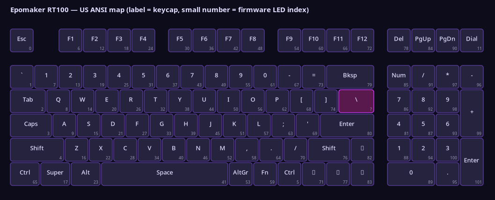

# epomaker-rt100

Linux desktop control for the **Epomaker RT100** — the little screen first:
still images, animated GIFs, and a live clock / CPU / temperature readout.
Per-key RGB and the firmware's built-in light effects come along too.



## Do you actually need this?

Be honest with yourself about what you want to control:

| If you want… | Use |
|---|---|
| **Only RGB lighting** | [**OpenRGB**](https://openrgb.org/) — it already supports this exact keyboard (VID `0x3151`, PID `0x4010`, registered as *"Epomaker TH80 Pro"*). Mature, cross-platform, and it does not need any of this. |
| **Key remapping or macros** | [**sharkfin**](https://github.com/dniminenn/sharkfin) — covers ~950 ROYUAN-based boards. No screen support. |
| **The screen** — images, GIFs, clock, CPU, temperature | This, or the [`epomakercontroller`](https://github.com/strodgers/epomaker-controller) CLI it is built on. |

The screen is the gap. OpenRGB and sharkfin do not touch it, and
`epomaker-controller` is the only Linux implementation of that protocol — this
project is a native desktop front end for it, plus the US ANSI layout and system
integration the library leaves to callers.

**Credit where it is due:** all USB HID work is
[`strodgers/epomaker-controller`](https://github.com/strodgers/epomaker-controller)
by Sam Rodgers, MIT licensed. This is a downstream application that depends on
it — not a fork. `.upstream-commit` pins the exact commit used, so upstream
fixes arrive by bumping one file.

## Features

**Backlight**
- One solid colour across the whole board.
- All 19 built-in firmware effects, with speed, brightness, dazzle and
  direction, plus a "next effect" button to step through them.
- Per-key colours from a clickable layout. Select any number of keys, pick a
  colour, then send. Selections and colours persist between runs.

**System info**
- Sync the keyboard's clock, and show live CPU and temperature.
- Start/stop a background updater, and enable it at login.

**Screen**
- File picker with a live, actual-size preview.
- Three fitting choices — show the whole image (letterboxed), fill and crop, or
  stretch — with a configurable bar colour.
- **Animated GIFs play on the screen**, natively — see
  [GIFs and animation](#gifs-and-animation). Or send one chosen frame as a
  full-resolution still.
- Progress by packet during upload.
- Automatically re-sends the picture after a backlight change, because writing
  key colours clears the screen. Switchable.

## Screen updater (clock, CPU, temperature)

The screen can show the time, CPU load and a temperature sensor, kept current by
a small background service:

**Installed from the AUR**, the unit is already in place — just switch it on:

```bash
systemctl --user enable --now epomaker-controller.service
```

**From source**, install the unit first:

```bash
./install-service.sh                 # defaults to the coretemp-0 CPU package sensor
./install-service.sh --list-sensors  # see what this machine offers
./install-service.sh nvme-0          # or pick another
./install-service.sh --uninstall
```

Either way, use the **System info** tab to start it, stop it, enable it at login, choose
the sensor, and sync the clock. The keyboard has no battery-backed clock, so it
shows whatever the host last sent and resets when unplugged.

It is a **user** unit, deliberately: starting and stopping it needs no
authorisation, so the GUI can pause it around other operations without a polkit
prompt and without ever touching sudo. Because it holds the HID interface, the
app stops it around every keyboard operation and restarts it afterwards.

The unit runs `epomaker-rt100-daemon`, not upstream's
`epomakercontroller start-daemon`. Upstream's CLI opens the device with
`hid.device().open(vendor_id, product_id)`, which takes **interface 0** — the one
carrying key input — so it interferes with typing.

## Launcher entry

Installed from the AUR, the desktop entry is already there. From source:

```bash
./install-desktop.sh          # writes ~/.local/share/applications, no root
./install-desktop.sh --uninstall
```

Then type "Epomaker" or "RT100" into whatever already opens your launcher. This
is a user-level XDG desktop entry, so **no keybind or compositor configuration
is needed** — any launcher that reads the standard directories finds it (wofi,
rofi, fuzzel, GNOME, Plasma).

## Requirements

- Linux, Wayland or X11.
- Python 3.10+, PyGObject, GTK 4.10+ and libadwaita 1.4+.
- An RT100 connected **over USB with its cable**. The 2.4 GHz dongle does not
  work: 0.0.9 added a wireless path, but its handshake never completes on this
  hardware — the device answers `00015d0000010101…` where the library looks for
  `01010168`, so `send_wireless_init()` returns False and the device is never
  opened. Tested, not assumed. Bluetooth is not implemented at all.

## Install

### Arch / CachyOS — from the AUR

```bash
paru -S epomaker-rt100-gtk-git    # desktop app  ->  epomaker-rt100-gtk
paru -S epomaker-rt100-git        # terminal app ->  epomaker-rt100
```

The GTK package depends on the base one, so installing it gets you both
commands. Install only the base package on a headless machine and no desktop
libraries are pulled in.

Both are `-git` packages: they build from the latest commit, so updates arrive
through a normal `paru -Syu`.

Every dependency comes from the official repositories. The upstream library is
built from the pinned commit in `.upstream-commit` and bundled, because its own
package must depend on `python-opencv` — which pulls VTK, OpenMPI, hdf5 and
qt6-base, about 436 MiB — for five image calls that Pillow and numpy cover
here. Installing this therefore **conflicts** with `python-epomakercontroller-git`;
install that separately only if you want upstream's `epomakercontroller` CLI.

After installing, apply the udev rule (see [Permissions](#permissions-required))
and replug the keyboard.

### Any distribution — from source

```bash
sudo pacman -S --needed python-gobject gtk4 libadwaita python-pillow  # Arch
# Debian/Ubuntu: sudo apt install python3-gi gir1.2-gtk-4.0 gir1.2-adw-1 \
#                                 python3-pil libhidapi-libusb0

git clone https://github.com/dwaycik/epomaker-rt100
cd epomaker-rt100
python -m venv --system-site-packages .venv
.venv/bin/pip install -e ".[tui]"
.venv/bin/pip install --no-deps \
    "git+https://github.com/strodgers/epomaker-controller@$(cat .upstream-commit)"
./install-desktop.sh && ./install-service.sh
```

`--system-site-packages` is what lets the venv see PyGObject, which is painful
to build from PyPI and ships working on every target distro. `.upstream-commit`
pins the library commit this was tested against — 0.0.9 has the native GIF
support and drops the old `hidapi==0.14.0` pin, but has never been released to
PyPI, so it must come from git.

That gives you `.venv/bin/epomaker-rt100` and `.venv/bin/epomaker-rt100-gtk`.

### Permissions (required)

`import hid` resolves to hidapi's **libusb** backend, which talks to
`/dev/bus/usb/...`. That node is root-only by default, and the ACLs
systemd-logind puts on `/dev/hidraw*` do **not** help because the libusb
backend never opens those.

**Installed from the AUR**, the rule is already at
`/usr/lib/udev/rules.d/70-epomaker-rt100.rules` — it just has to be picked up:

```bash
sudo udevadm control --reload-rules && sudo udevadm trigger
# then UNPLUG AND REPLUG the keyboard
```

**From source**, install it first:

```bash
sudo install -m644 udev/70-epomaker-rt100.rules /etc/udev/rules.d/
sudo udevadm control --reload-rules && sudo udevadm trigger
# then unplug and replug the keyboard
```

Two deliberate choices in that rule:

- **The filename must sort before `73-seat-late.rules`.** That is the rule which
  turns `TAG=="uaccess"` into an actual ACL. A file named `99-…` sets the tag
  too late and is silently ignored. Hence `70-`.
- **`TAG+="uaccess"`, not `MODE="0666" GROUP="plugdev"`.** uaccess grants only
  the user at the active seat. `0666` would make the keyboard world-writable,
  and `plugdev` does not exist as a group on Arch. The library's own
  `epomakercontroller dev --udev` writes the `0666`/`plugdev` form; this rule is
  the systemd-standard equivalent.

The app never escalates privileges. If a permission error comes back it shows
these commands rather than trying to run them.

## Run

```bash
epomaker-rt100        # terminal
epomaker-rt100-gtk    # desktop
```

From a source install those live in `.venv/bin/` rather than on `PATH`.

## Things worth knowing

**Three HID interfaces.** The RT100 exposes interfaces 0, 1 and 2. Interface 0
carries key input and using it interferes with normal typing. The app defaults
to **interface 1** and the choice is in the header bar.

The library has no interface argument, and 0.0.9 made this worse rather than
better: it opens with `hid.device().open(vendor_id, product_id)`, which takes
whatever hidapi enumerates first — **interface 0**. So `RT100._open_device` here
replaces it with a path-based open, filtering `hid.enumerate()` on
`interface_number`. This is why the background updater runs this app's
`--daemon` mode rather than upstream's CLI.

**Screen size is 162 × 173.** Read from the library's
`commands/data/constants.py` (`IMAGE_DIMENSIONS`), not guessed. That value is a
`cv2.resize` dsize, so it reads *(width, height)*. The library's `encode_image`
resizes with no aspect handling at all, which is why the fitting happens in this
app before the file is handed over.

**The CPU/temp daemon holds the device.** It holds it for *any* operation, not
just uploads, so the app stops it around every one of them: it checks
`systemctl --user is-active` then `systemctl is-active` for
`epomaker-controller.service`, stops it, and restarts it in a `finally` block —
the same approach as the library repo's `service/epomaker-upload-image` helper.
Override the unit name with `EPOMAKER_SERVICE_NAME`. User units are tried first
because stopping those needs no authorisation.

**Packet pacing.** The firmware erases SRAM on the init report and needs a pause
before data arrives; the endpoint buffer can also overflow if reports arrive too
fast, historically corrupting the high-index right-hand keys. This app waits
250 ms after the init report, and paces key-frame packets by 10 ms (only 8
packets, so it costs nothing). The 1002-packet image upload keeps upstream's
back-to-back timing, since that path is known to work as-is.

**Signal handling is disabled.** `EpomakerController.__init__` installs
SIGINT/SIGTERM handlers that call `os._exit(0)`, which fights GTK and restricts
construction to the main thread. `RT100._setup_signal_handling` is a no-op and
the device is closed in a `finally` block instead.

## GIFs and animation

Animated GIFs **do** play on the screen, natively. Upstream added
`EpomakerGifCommand` in **0.0.9**, implementing the multi-frame protocol sniffed
from the vendor software: an `0xa5` init report carrying frame count, frame delay
and per-frame size, then 1001 reports per frame.

This is why the install instructions point at **git, not PyPI** — the newest
release on PyPI is 0.0.8, which predates it. (Upstream's README still lists
"Upload GIFs" under TODO; the README is simply stale.)

Limits, all from the library's own code:

- **Up to 56 frames**, at **15 fps**. Longer GIFs are subsampled, and the app
  tells you how many of how many will be sent.
- **Animations are 128×128, not 162×173.** `best_gif_dimensions()` fits the
  source into the screen and then floors each axis to a multiple of 64, because
  the firmware's animation framebuffer is 4K page-aligned and a non-aligned frame
  size produces vertical line artifacts. Within 162×173 the only multiple of 64
  available is 128. The preview renders at the real upload size so you can see
  the difference before sending.

**Upstream bug this app works around:** `best_gif_dimensions()` floors the short
axis of a wide source to zero — `800×200` returns `(128, 0)`. That passes its own
`w*h*2 % 4096 == 0` check and uploads nothing usable. This app pre-renders every
frame to exactly 128×128 using your chosen fitting, so the library always gets a
square source and the bug cannot trigger.

Turn **"Play the animation"** off to send a single frame as a full-resolution
still instead; the frame picker appears when you do.

Animation needs Pillow, which the library's own `EpomakerGifCommand` imports but
does not declare as a dependency. Without it, stills still work.

## Observed hardware behaviour

Measured on an RT100, 2026-07-30. Neither of these is documented upstream:

- **Backlight writes clear the screen.** Setting key colours issues the `0x18`
  "erase key SRAM" init report, and the screen's content buffer goes with it —
  the screen blanks until something redraws it. The app therefore remembers your
  last uploaded picture and re-sends it after any backlight change ("Keep this
  picture after backlight changes", on by default). Turn it off if you would
  rather backlight changes stay instant.
- **Brightness below 3 leaves the LEDs off.** The firmware range is 0–4, but only
  3 and 4 actually light the keys. The full range is still exposed because 0 is
  the only way to switch the backlight off outright; the UI says as much so the
  low steps do not look broken.

## Known unknowns

Two mappings are genuinely not recorded in the library, which ships a **UK ISO**
layout only. They are not guessed here:

- **The backslash key — resolved.** On a US ANSI board it is **LED index 75**,
  which the library's UK ISO keymap calls `HASH`. Confirmed on hardware
  2026-07-31 and now the default. The library records only the ISO map, where
  index 10 is the key between Left Shift and Z and index 75 is the key left of
  Enter; ANSI has neither switch, and index 75 is the matrix position they
  share. The **"Test next candidate"** button remains for other boards.
- **Which Ctrl is which.** The library's ISO layout lists `RIGHT_CTRL` at the
  far left of the bottom row and `LEFT_CTRL` at the right. That looks like an
  upstream mix-up, but it is the only record, and LED indices are not geometric
  (index 11 is the DIAL, which sits top-right), so it cannot be derived. Both
  caps read "Ctrl", so it only matters if the wrong one lights — swap the two
  names in `ANSI_LAYOUT` if so.

Per-key colours can be overridden by an active firmware effect. If a colour does
not appear, set the effect to **Always On** first.

## Adding another layout

`ANSI_LAYOUT` maps a key name to `(x, y, width, height)` in keycap units. Key
*names* and LED indices are read from the library's keymap at runtime, so a new
layout only needs geometry. `tools/render_layout.py` draws the table to a PNG so
you can check it:

```bash
.venv/bin/python tools/render_layout.py
```

## Prior art

- [`strodgers/epomaker-controller`](https://github.com/strodgers/epomaker-controller)
  — the library this wraps. Ships a Tkinter per-key GUI, UK ISO only.
- [`tejmar/epomaker-controller`](https://github.com/tejmar/epomaker-controller)
  — a separate re-upload of that package with a much larger Tkinter GUI,
  including a DynaTab 60×9 screen designer and GIF import. Covers a lot of the
  same ground if you do not care about a native desktop look.
- [`zuev-stepan/rt100-wireless-display`](https://github.com/zuev-stepan/rt100-wireless-display)
  — drives the RT100 screen over the 2.4 GHz dongle, which the library cannot do.

## Licence

MIT, matching the library it wraps. See `LICENSE`.
